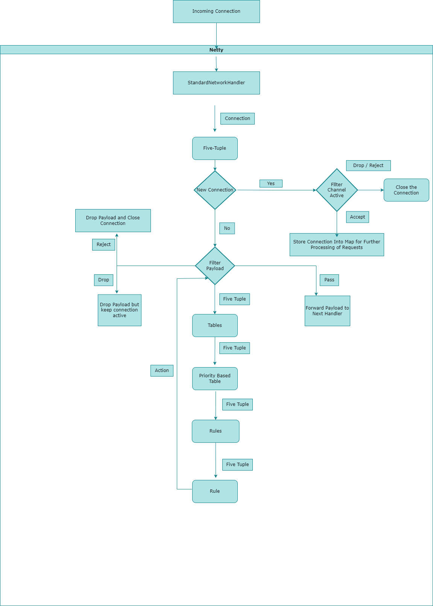

# Netty Security
### This is an extension of Netty 5 which provides security features.
Current Status: In-Development
 

Features:
* Granular Traffic Control using Protocol, Source IP, Source Port, Destination IP, Destination Port and Payload.
* Payload match types: Normal Bytes Matching, String Matching, and Regex Matching.
* Extensible API for Custom Protocol

 

Upcoming Features:
* Rate-Limiting
* HTTP Extension
* Common Vulnerability Detection and Prevention
* Pluggable Metrics
* Configuration File Persistence
 

## Flow Chart

